# codemaker配表模式手册
本模式用于codemaker插件，暴露skills，resources文件夹表格以及接口，让codemaker通过这几个部件来实现对表格的增删改查。

该模式需要启动后端，也就是需要用到两个终端：
```bash
$env:OPENCODE_SERVER_USERNAME="codemaker"
$env:OPENCODE_SERVER_PASSWORD="CMniubi2026"
codemaker serve --port 8666 --hostname 0.0.0.0
```

```bash
Get-Content .env | Where-Object { $_ -and -not $_.StartsWith('#') } | ForEach-Object { $kv=$_.Split('=',2); Set-Item -Path ("env:"+$kv[0].Trim()) -Value $kv[1].Trim() }

uv run python server/main.py
```

在插件页面输入“进入配表模式”
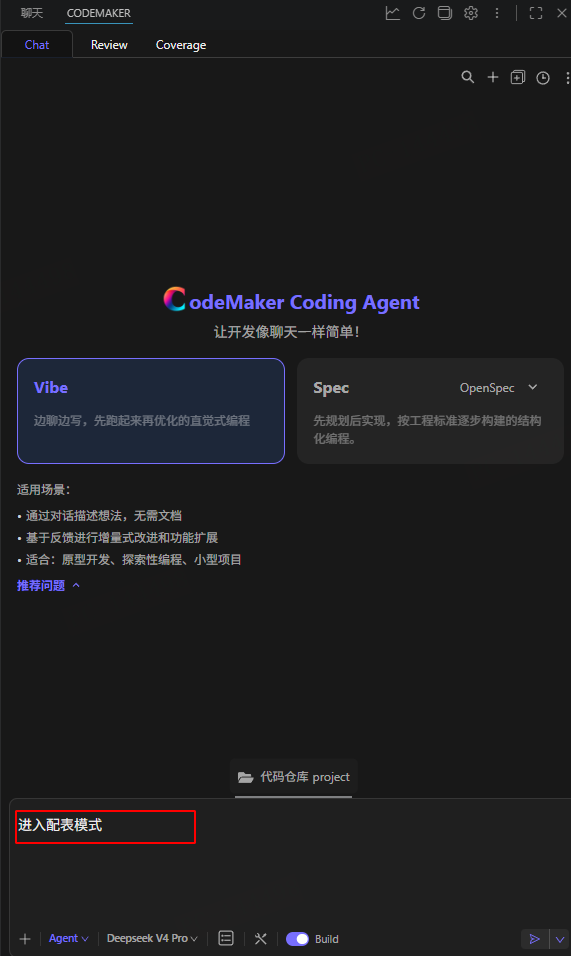

codemaker会读取文件夹中的TABLE_MODE.md文件，需要是否进入配表操作模式，点击“确认进入”
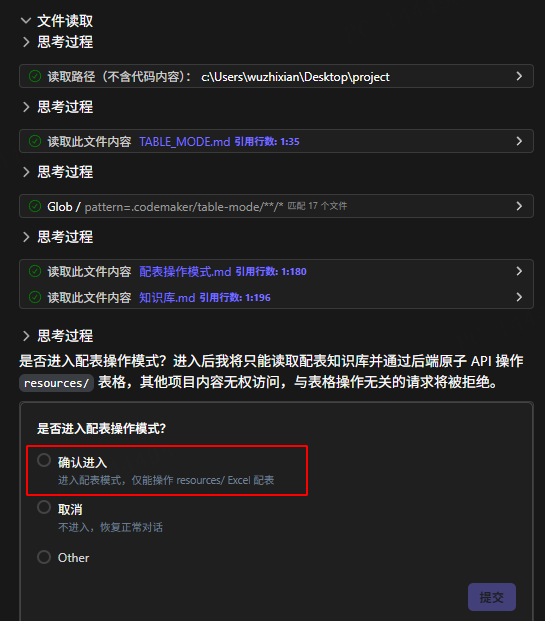

正式进入配表操作模式
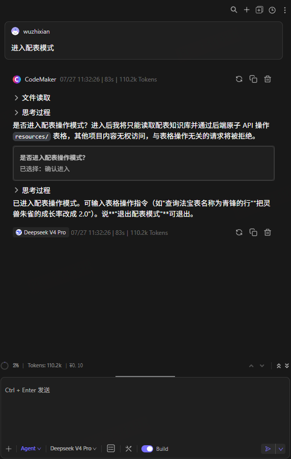

**查询灵兽饕餮的所有信息**
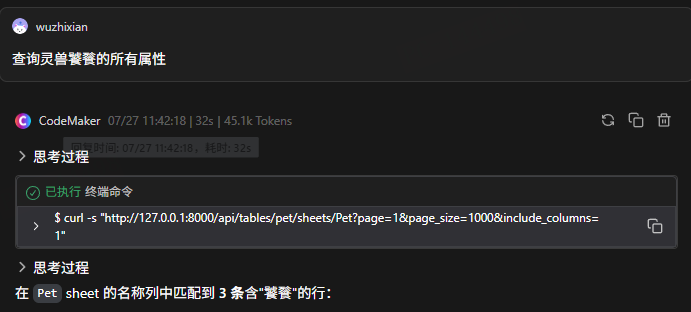
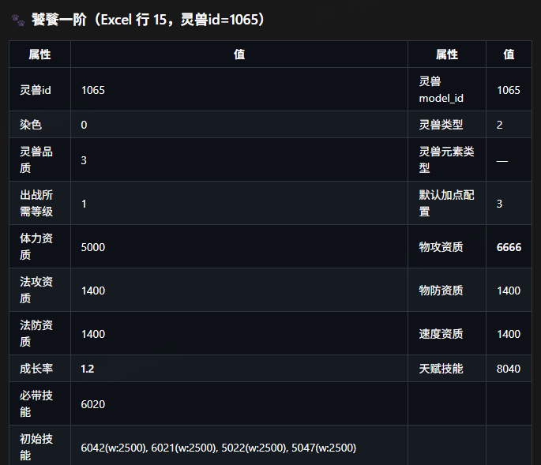
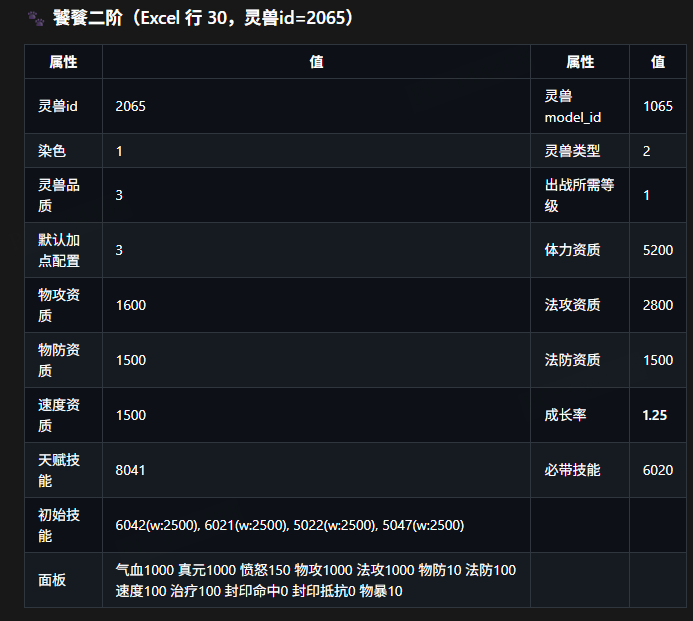
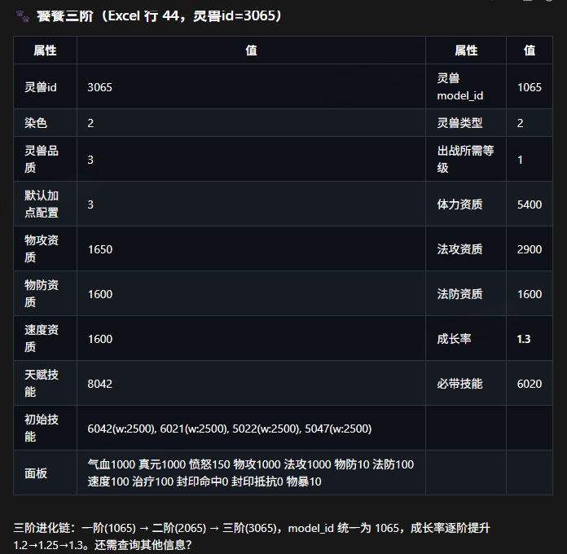

**将能力名称为三味真火测试版的神通描述修改为TEST**
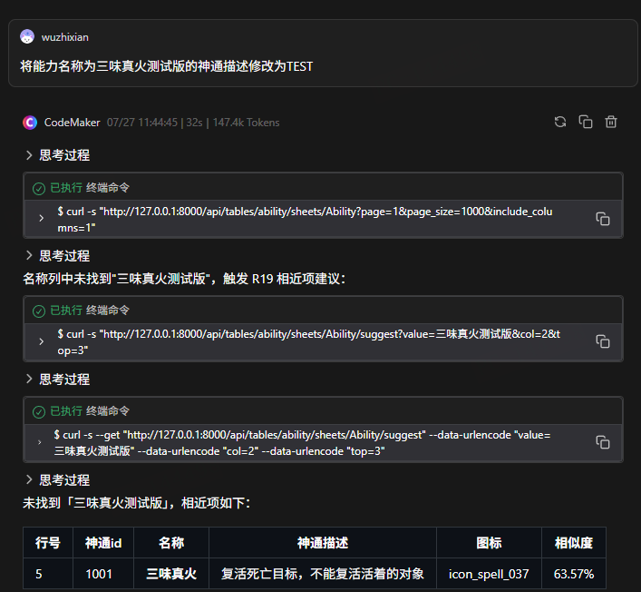
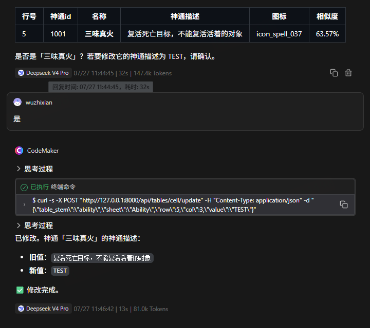

**删除法宝名称为测试法宝3的信息**
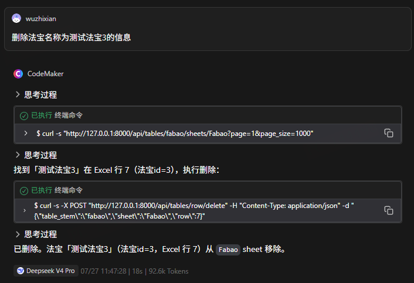

**增加灵兽名称为测试灵兽1，id是1145**
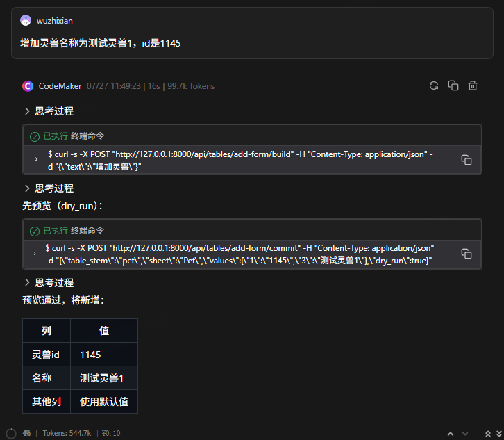
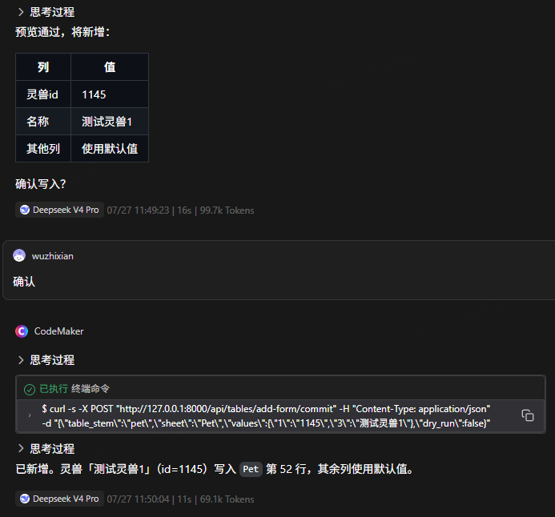

输入与表格操作无关的内容会拒答：
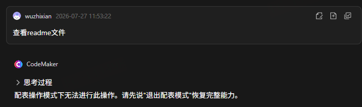

输入"退出配表模式"可以实现退出模式
