# 重要内容

## Excel-Agent表格处理
已增加可选模型方式：

**新增一个NPC叫'神秘行商'，model_id 1009，放在space_id 10001坐标(80,0,50)，玩家点击后弹出对话'客官里面请，今日新到一批奇珍异宝'，选项'进来瞧瞧'和'下次再来'**
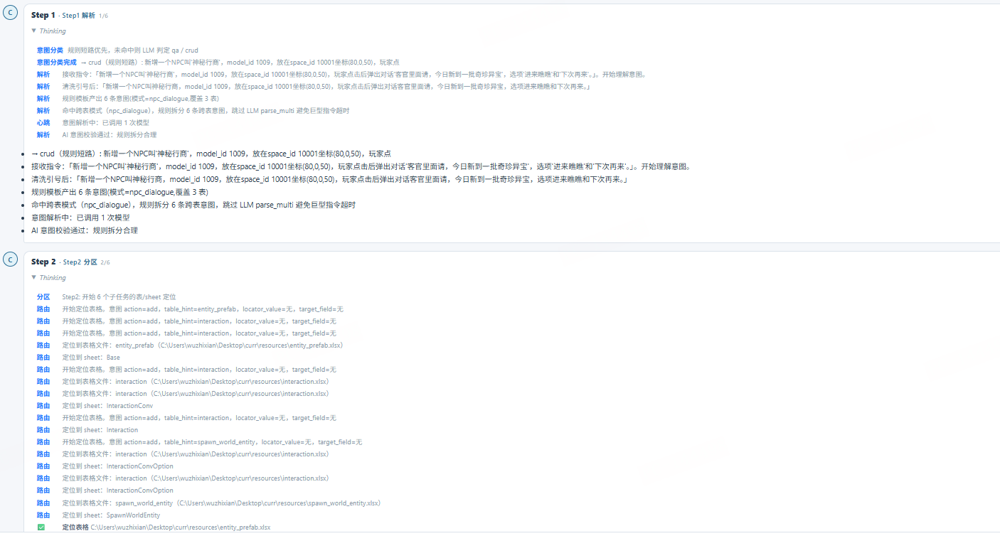
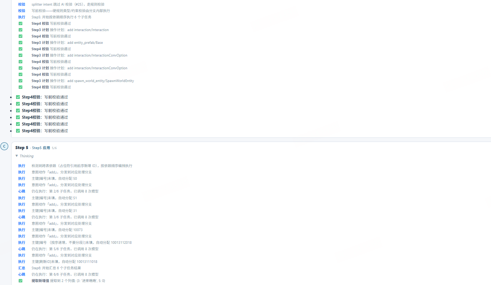
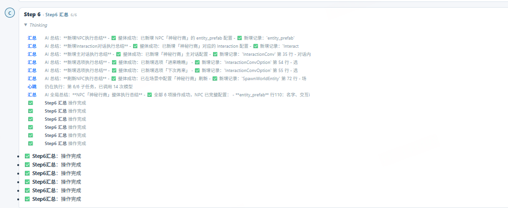

**新增一个NPC叫'酒馆老板'，model_id 1011，放在space_id 10001坐标(70,0,40)，玩家点击后弹出对话'客官打尖还是住店？'，选项'打尖'和'住店'，点'打尖'后老板说'好嘞，酒菜这就端来，见面礼reward_id 10070请笑纳'，再点'多谢'关闭。**
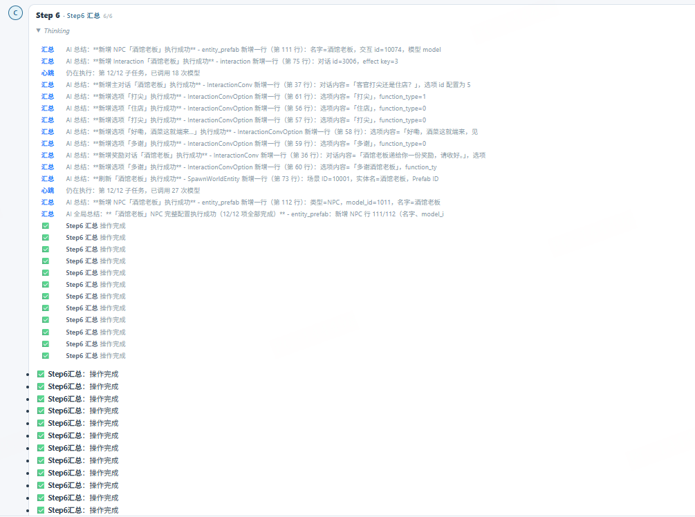

## Merge合并引导

### 分支合并
#### absorb（分支与分支合并）
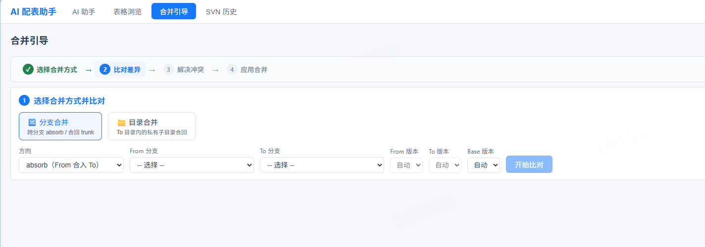
选择分支后会得出各自的SVN版本
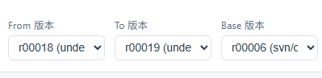

比对完成以后表格显示如下：
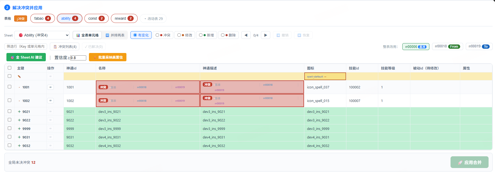
表格部分只展示存在冲突的表格，如果需要查看修改的表格，可以右边《改动表》点击开始展开；
sheet可以点击下拉框展开

- 两种表格展示方式：
**全表单元格**
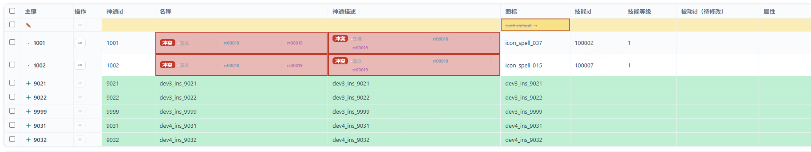
这种情况冲突会显示在单元格中，然后点击冲突单元格可以出现窗口具体展示冲突，进行选择
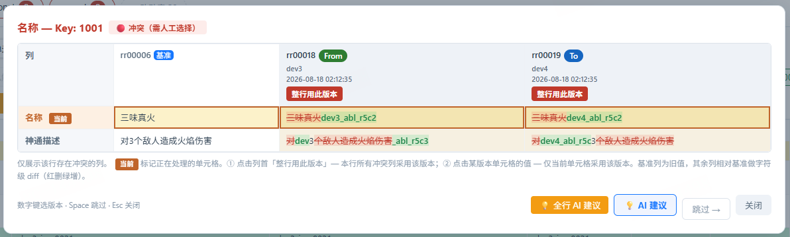

**并排两表**
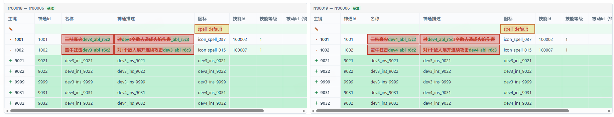
界面展示两个表格，分别展示两个分支与base的差异表格，可以点击其中一个表格的单元格实现冲突解决；

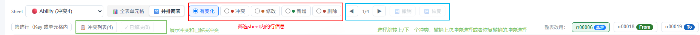

全sheet AI建议：
**全表单元格**会将AI建议显示在单元格中
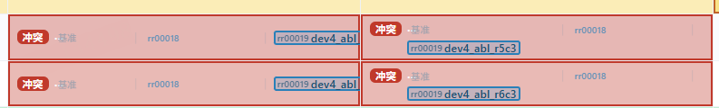
点击单元格可以看到AI建议：
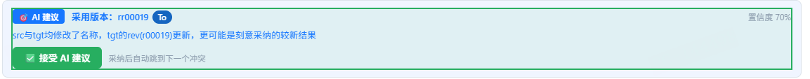

**并排两表**会在表格体当中用蓝色来标识AI建议的单元格
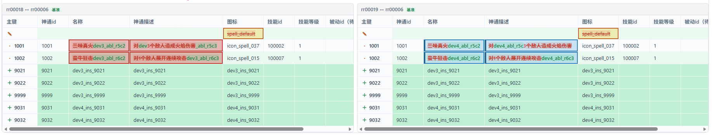

可以通过在输入置信度以后选择批量采纳高置信来实现采纳AI建议；

完成冲突处理后点击《应用合并》会跳出变更汇总：
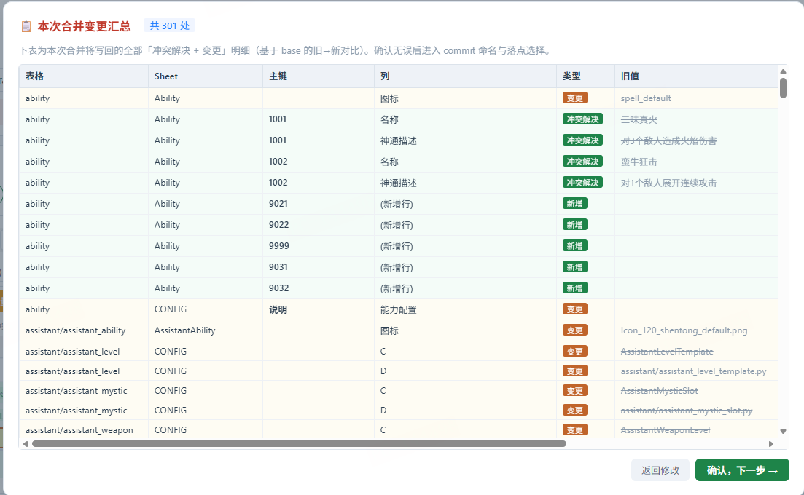

确认后会进入commit名称填写和写回选择：
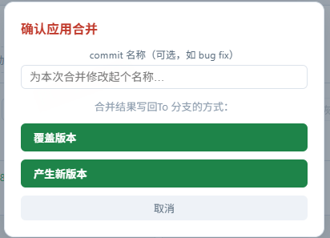

之后提交历史可以记录本次的操作
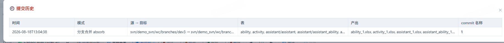

#### merge_back（合回trunk）
这部分merge_back默认To分支是trunk当前的最新版本，选择分支以后会自动寻找trunk最新版本，得到各自的版本号

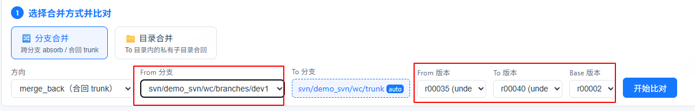
比对完成后的表体内容与上文一致
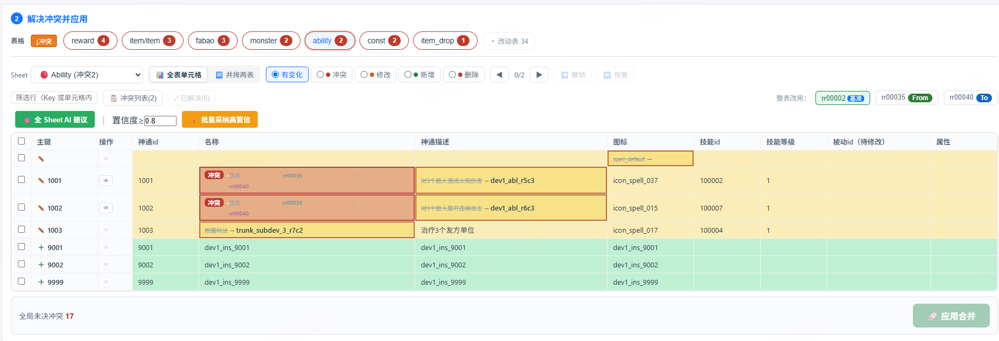

### 目录合并
优先选择To目录，当前表格资源To目录选择trunk分支
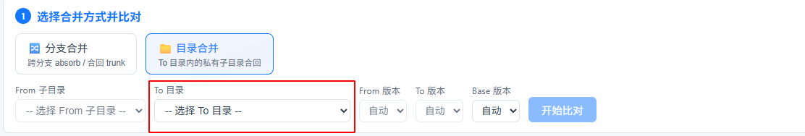
trunk分支会在目录下寻找子目录
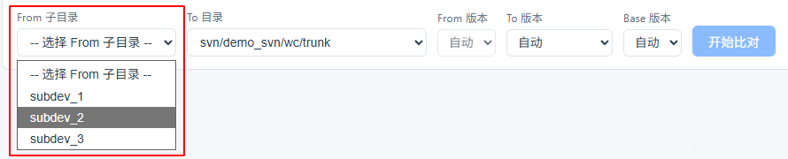

开始比对以后展示内容与上述的分支合并一致
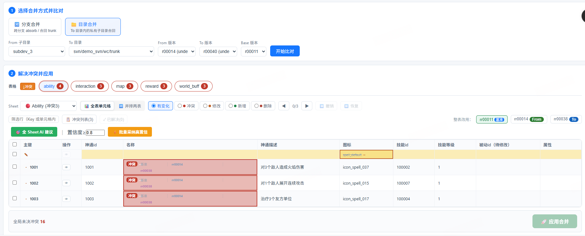